Pirámides
================
Ana Escoto
11/12/2020


<https://sites.google.com/politicas.unam.mx/inv-aplicada/>

# Previo

## Paquetería

``` r
if (!require("pacman")) install.packages("pacman") # instala pacman si se requiere
```

    ## Loading required package: pacman

``` r
pacman::p_load(tidyverse, 
               haven, #lectura de datos .sav y .dta
               janitor, skimr, #limpieza y verificación
               apyramid) # Para hacer pirámides
```

## Base

Vamos a trabajar con las proyecciones de CONAPO. No son microdatos, sino
que están agregados.

``` r
pob_mit_proyecciones <- read.csv("https://github.com/aniuxa/R_Demo/raw/master/datos/pob_mit_proyecciones.csv", encoding = "latin1")
```

Son las poblaciones a mitad de julio de CONAPO:
<http://www.conapo.gob.mx/work/models/CONAPO/Datos_Abiertos/Proyecciones2018/pob_mit_proyecciones.csv>

Vamos a limpiar los nombres:

``` r
pob_mit_proyecciones<-clean_names(pob_mit_proyecciones)
```

Base de ECOVID - ML

``` r
ecovid0420 <- read_dta("https://github.com/aniuxa/R_Demo/raw/master/datos/ecovid0420.dta")
```

# Pirámides con datos agregados

Revisemos esta base de datos de las proyecciones de población.

``` r
skimr::skim(pob_mit_proyecciones)
```

|                                                  |                        |
| :----------------------------------------------- | :--------------------- |
| Name                                             | pob\_mit\_proyecciones |
| Number of rows                                   | 592460                 |
| Number of columns                                | 7                      |
| \_\_\_\_\_\_\_\_\_\_\_\_\_\_\_\_\_\_\_\_\_\_\_   |                        |
| Column type frequency:                           |                        |
| character                                        | 2                      |
| numeric                                          | 5                      |
| \_\_\_\_\_\_\_\_\_\_\_\_\_\_\_\_\_\_\_\_\_\_\_\_ |                        |
| Group variables                                  | None                   |

Data summary

**Variable type: character**

| skim\_variable | n\_missing | complete\_rate | min | max | empty | n\_unique | whitespace |
| :------------- | ---------: | -------------: | --: | --: | ----: | --------: | ---------: |
| entidad        |          0 |              1 |   6 |  19 |     0 |        33 |          0 |
| sexo           |          0 |              1 |   7 |   7 |     0 |         2 |          0 |

**Variable type: numeric**

| skim\_variable | n\_missing | complete\_rate |      mean |        sd |   p0 |      p25 |      p50 |      p75 |    p100 | hist  |
| :------------- | ---------: | -------------: | --------: | --------: | ---: | -------: | -------: | -------: | ------: | :---- |
| renglon        |          0 |              1 | 296230.50 | 171028.61 |    1 | 148115.8 | 296230.5 | 444345.2 |  592460 | ▇▇▇▇▇ |
| ano            |          0 |              1 |   2009.62 |     23.70 | 1950 |   1989.0 |   2010.0 |   2030.0 |    2050 | ▁▇▇▇▇ |
| cve\_geo       |          0 |              1 |     15.88 |      9.59 |    0 |      8.0 |     16.0 |     24.0 |      32 | ▇▆▇▆▇ |
| edad           |          0 |              1 |     54.50 |     31.75 |    0 |     27.0 |     54.5 |     82.0 |     109 | ▇▇▇▇▇ |
| poblacion      |          0 |              1 |  31142.55 | 113815.57 |    0 |   1353.0 |   8429.0 |  23210.0 | 1198088 | ▇▁▁▁▁ |

## Edad y sexo

La edad y sexo son de las variables más importantes en la demografía
para explicar la estructura de una población. Las pirámides son parte
esencial de lo que llamamos “Demografía estática”

``` r
pob_mit_proyecciones %>% 
  filter(cve_geo==0) %>% 
  filter(ano==2020) %>% 
  count(edad, sexo, wt=poblacion)
```

    ##     edad    sexo       n
    ## 1      0 Hombres 1087447
    ## 2      0 Mujeres 1048275
    ## 3      1 Hombres 1093379
    ## 4      1 Mujeres 1054636
    ## 5      2 Hombres 1100800
    ## 6      2 Mujeres 1061974
    ## 7      3 Hombres 1108402
    ## 8      3 Mujeres 1069224
    ## 9      4 Hombres 1114769
    ## 10     4 Mujeres 1075251
    ## 11     5 Hombres 1119479
    ## 12     5 Mujeres 1079856
    ## 13     6 Hombres 1122374
    ## 14     6 Mujeres 1082945
    ## 15     7 Hombres 1123921
    ## 16     7 Mujeres 1084339
    ## 17     8 Hombres 1125153
    ## 18     8 Mujeres 1085091
    ## 19     9 Hombres 1126053
    ## 20     9 Mujeres 1086065
    ## 21    10 Hombres 1127584
    ## 22    10 Mujeres 1087661
    ## 23    11 Hombres 1129609
    ## 24    11 Mujeres 1089876
    ## 25    12 Hombres 1131125
    ## 26    12 Mujeres 1091850
    ## 27    13 Hombres 1132647
    ## 28    13 Mujeres 1093043
    ## 29    14 Hombres 1134624
    ## 30    14 Mujeres 1094700
    ## 31    15 Hombres 1135375
    ## 32    15 Mujeres 1096156
    ## 33    16 Hombres 1132192
    ## 34    16 Mujeres 1094702
    ## 35    17 Hombres 1125251
    ## 36    17 Mujeres 1090828
    ## 37    18 Hombres 1117509
    ## 38    18 Mujeres 1087223
    ## 39    19 Hombres 1109641
    ## 40    19 Mujeres 1083771
    ## 41    20 Hombres 1102086
    ## 42    20 Mujeres 1079684
    ## 43    21 Hombres 1096148
    ## 44    21 Mujeres 1075574
    ## 45    22 Hombres 1091600
    ## 46    22 Mujeres 1072730
    ## 47    23 Hombres 1087899
    ## 48    23 Mujeres 1072186
    ## 49    24 Hombres 1085130
    ## 50    24 Mujeres 1073520
    ## 51    25 Hombres 1082381
    ## 52    25 Mujeres 1074674
    ## 53    26 Hombres 1076872
    ## 54    26 Mujeres 1072980
    ## 55    27 Hombres 1067297
    ## 56    27 Mujeres 1068216
    ## 57    28 Hombres 1053499
    ## 58    28 Mujeres 1061332
    ## 59    29 Hombres 1034307
    ## 60    29 Mujeres 1051403
    ## 61    30 Hombres 1011472
    ## 62    30 Mujeres 1039180
    ## 63    31 Hombres  988604
    ## 64    31 Mujeres 1027221
    ## 65    32 Hombres  965801
    ## 66    32 Mujeres 1015218
    ## 67    33 Hombres  942390
    ## 68    33 Mujeres 1002010
    ## 69    34 Hombres  919305
    ## 70    34 Mujeres  988221
    ## 71    35 Hombres  896592
    ## 72    35 Mujeres  974208
    ## 73    36 Hombres  873907
    ## 74    36 Mujeres  959980
    ## 75    37 Hombres  851872
    ## 76    37 Mujeres  945900
    ## 77    38 Hombres  831435
    ## 78    38 Mujeres  932221
    ## 79    39 Hombres  813363
    ## 80    39 Mujeres  919070
    ## 81    40 Hombres  798429
    ## 82    40 Mujeres  906932
    ## 83    41 Hombres  786879
    ## 84    41 Mujeres  896078
    ## 85    42 Hombres  778434
    ## 86    42 Mujeres  886410
    ## 87    43 Hombres  772787
    ## 88    43 Mujeres  877830
    ## 89    44 Hombres  769375
    ## 90    44 Mujeres  870050
    ## 91    45 Hombres  764980
    ## 92    45 Mujeres  860137
    ## 93    46 Hombres  757394
    ## 94    46 Mujeres  846516
    ## 95    47 Hombres  746793
    ## 96    47 Mujeres  830179
    ## 97    48 Hombres  732815
    ## 98    48 Mujeres  811113
    ## 99    49 Hombres  715821
    ## 100   49 Mujeres  789955
    ## 101   50 Hombres  696964
    ## 102   50 Mujeres  767549
    ## 103   51 Hombres  677054
    ## 104   51 Mujeres  744410
    ## 105   52 Hombres  656393
    ## 106   52 Mujeres  721093
    ## 107   53 Hombres  635666
    ## 108   53 Mujeres  698207
    ## 109   54 Hombres  615300
    ## 110   54 Mujeres  676110
    ## 111   55 Hombres  595239
    ## 112   55 Mujeres  654659
    ## 113   56 Hombres  575163
    ## 114   56 Mujeres  633454
    ## 115   57 Hombres  554862
    ## 116   57 Mujeres  612236
    ## 117   58 Hombres  534116
    ## 118   58 Mujeres  590710
    ## 119   59 Hombres  512657
    ## 120   59 Mujeres  568495
    ## 121   60 Hombres  490368
    ## 122   60 Mujeres  545388
    ## 123   61 Hombres  467264
    ## 124   61 Mujeres  521365
    ## 125   62 Hombres  443508
    ## 126   62 Mujeres  496619
    ## 127   63 Hombres  419402
    ## 128   63 Mujeres  471502
    ## 129   64 Hombres  395342
    ## 130   64 Mujeres  446438
    ## 131   65 Hombres  371668
    ## 132   65 Mujeres  421793
    ## 133   66 Hombres  348231
    ## 134   66 Mujeres  397629
    ## 135   67 Hombres  325584
    ## 136   67 Mujeres  373826
    ## 137   68 Hombres  303653
    ## 138   68 Mujeres  350451
    ## 139   69 Hombres  281962
    ## 140   69 Mujeres  327678
    ## 141   70 Hombres  263044
    ## 142   70 Mujeres  307972
    ## 143   71 Hombres  245905
    ## 144   71 Mujeres  289911
    ## 145   72 Hombres  228560
    ## 146   72 Mujeres  271286
    ## 147   73 Hombres  212000
    ## 148   73 Mujeres  253512
    ## 149   74 Hombres  196198
    ## 150   74 Mujeres  236526
    ## 151   75 Hombres  181139
    ## 152   75 Mujeres  220312
    ## 153   76 Hombres  166687
    ## 154   76 Mujeres  204682
    ## 155   77 Hombres  152868
    ## 156   77 Mujeres  189639
    ## 157   78 Hombres  140048
    ## 158   78 Mujeres  175607
    ## 159   79 Hombres  127762
    ## 160   79 Mujeres  162010
    ## 161   80 Hombres  115671
    ## 162   80 Mujeres  148399
    ## 163   81 Hombres  104116
    ## 164   81 Mujeres  135195
    ## 165   82 Hombres   93281
    ## 166   82 Mujeres  122638
    ## 167   83 Hombres   83179
    ## 168   83 Mujeres  110754
    ## 169   84 Hombres   73767
    ## 170   84 Mujeres   99478
    ## 171   85 Hombres   65042
    ## 172   85 Mujeres   88823
    ## 173   86 Hombres   56978
    ## 174   86 Mujeres   78763
    ## 175   87 Hombres   49511
    ## 176   87 Mujeres   69250
    ## 177   88 Hombres   42618
    ## 178   88 Mujeres   60304
    ## 179   89 Hombres   36260
    ## 180   89 Mujeres   51906
    ## 181   90 Hombres   30398
    ## 182   90 Mujeres   44050
    ## 183   91 Hombres   25043
    ## 184   91 Mujeres   36758
    ## 185   92 Hombres   20354
    ## 186   92 Mujeres   30268
    ## 187   93 Hombres   16274
    ## 188   93 Mujeres   24515
    ## 189   94 Hombres   12786
    ## 190   94 Mujeres   19504
    ## 191   95 Hombres    9901
    ## 192   95 Mujeres   15288
    ## 193   96 Hombres    7502
    ## 194   96 Mujeres   11723
    ## 195   97 Hombres    5550
    ## 196   97 Mujeres    8762
    ## 197   98 Hombres    4001
    ## 198   98 Mujeres    6372
    ## 199   99 Hombres    2797
    ## 200   99 Mujeres    4498
    ## 201  100 Hombres    1895
    ## 202  100 Mujeres    3074
    ## 203  101 Hombres    1243
    ## 204  101 Mujeres    2030
    ## 205  102 Hombres     784
    ## 206  102 Mujeres    1291
    ## 207  103 Hombres     478
    ## 208  103 Mujeres     789
    ## 209  104 Hombres     277
    ## 210  104 Mujeres     459
    ## 211  105 Hombres     154
    ## 212  105 Mujeres     257
    ## 213  106 Hombres      80
    ## 214  106 Mujeres     135
    ## 215  107 Hombres      48
    ## 216  107 Mujeres      70
    ## 217  108 Hombres      20
    ## 218  108 Mujeres      30
    ## 219  109 Hombres      10
    ## 220  109 Mujeres      14

Podemos pensar en las pirámides como un doble histograma

``` r
pob_mit_proyecciones %>% 
  filter(cve_geo==0) %>% 
  filter(ano==2020) %>% 
  ggplot(
    aes(edad, weight=poblacion)
  ) + geom_histogram(binwidth = 5)
```

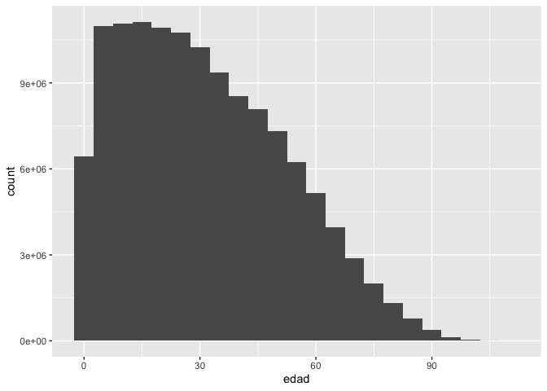<!-- -->

Tendríamos que darle la vuelta para verle más el parecido

``` r
pob_mit_proyecciones %>% 
  filter(cve_geo==0) %>% 
  filter(ano==2020) %>% 
  ggplot(
    aes(edad, weight=poblacion)
  ) + geom_histogram(binwidth = 5)  + # verificar el ancho de clase
  coord_flip()
```

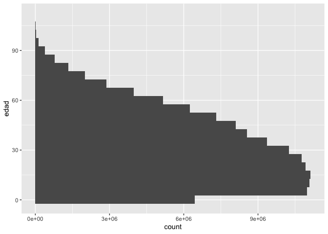<!-- -->

## Los grupos quinquenales, sí que sí

Si queremos hacerlo como gráficos de barra, seguramente queremos cortar
la variable de edad. Igual este paso es esencial en la vida demográfica:

``` r
pob_mit_proyecciones<-pob_mit_proyecciones %>% 
  mutate(eda5=cut(edad, # la variable a cortar
                  breaks=seq(0,110, # El rango válido
                             by=5), # El ancho del intervalo
                  include.lowest=T, # para que incluya el valor más bajo dentro del intervalo
                  right=F)) # indica si el intervalo irá abierto en la derecha, ponemos un no con "FALSE"
```

Veamos esta variable:

``` r
pob_mit_proyecciones %>% count(eda5, wt=poblacion)
```

    ##         eda5          n
    ## 1      [0,5) 1850369450
    ## 2     [5,10) 1798397314
    ## 3    [10,15) 1740546022
    ## 4    [15,20) 1650518583
    ## 5    [20,25) 1528556801
    ## 6    [25,30) 1415601789
    ## 7    [30,35) 1311311827
    ## 8    [35,40) 1208943818
    ## 9    [40,45) 1105462886
    ## 10   [45,50)  998015168
    ## 11   [50,55)  885777598
    ## 12   [55,60)  767255276
    ## 13   [60,65)  644700229
    ## 14   [65,70)  522585219
    ## 15   [70,75)  402225474
    ## 16   [75,80)  285455139
    ## 17   [80,85)  180727873
    ## 18   [85,90)   97828264
    ## 19   [90,95)   41841611
    ## 20  [95,100)   12408739
    ## 21 [100,105)    2052151
    ## 22 [105,110]     132230

``` r
### gráfico de barras de edades quinquenales
pob_mit_proyecciones %>%   
  filter(cve_geo==0) %>% 
  filter(ano==2020) %>% 
  ggplot(aes(eda5, weights=poblacion))+
    geom_bar() # dibuja la geometría de barra
```

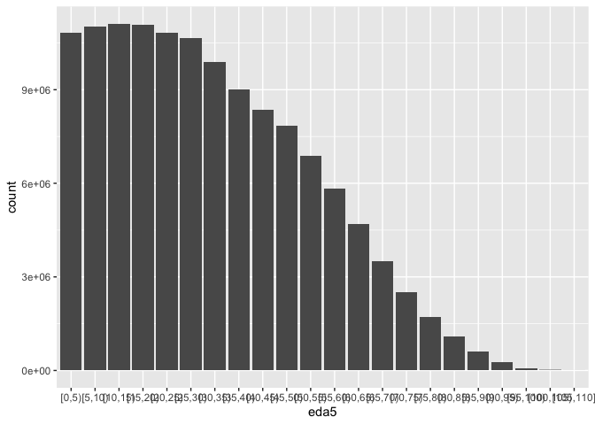<!-- -->

## La primera pirámide

Una pirámide es un histograma por sexo, donde el valor de los hombres es
negativo:

``` r
pob_mit_proyecciones %>% 
  filter(cve_geo==0) %>% 
  filter(ano==2020) %>% 
  mutate(poblacion=if_else(sexo=="Hombres", -poblacion, poblacion)) %>% 
  ggplot(aes(eda5, fill=sexo, weights=poblacion))+
    geom_bar() # dibuja la geometría de barra
```

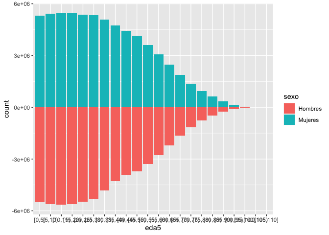<!-- -->

Podemos darle la vuelta y cambiarle los colores

``` r
pob_mit_proyecciones<-pob_mit_proyecciones %>% 
  mutate(poblacion2=if_else(sexo=="Hombres", -poblacion, poblacion))

pob_mit_proyecciones %>% 
  filter(cve_geo==0) %>% 
  filter(ano==2020) %>%  
  ggplot(aes(eda5, fill=sexo, weights=poblacion2))+
    geom_bar() + coord_flip() +
  scale_fill_brewer(palette = "Set2") + 
  theme_light() +   theme(axis.text.x  =  element_text(angle = 90))  
```

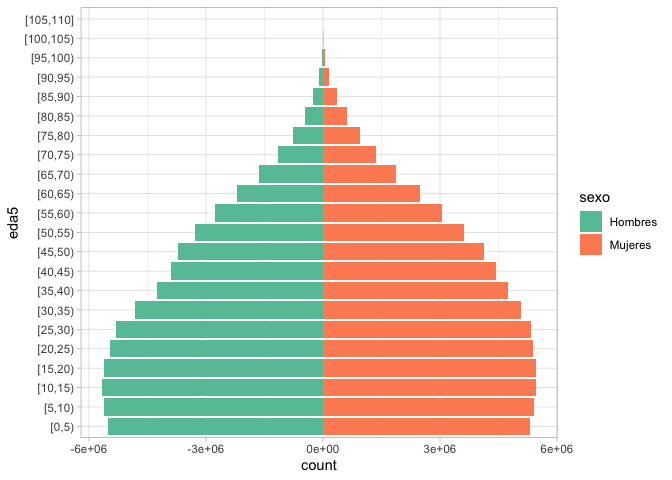<!-- -->

Como que las escalas tampoco están muy perfectas y no queremos las
negativa.¡Los hombres no son personas negativas\!

Veamos un poco cómo se comporta esa variable:

``` r
pob_mit_proyecciones %>% 
  filter(cve_geo==0) %>% 
  filter(ano==2020) %>%  
  count(eda5, sexo, wt=poblacion2) %>% 
  summarise(max=max(n), min=min(n))
```

    ##       max      min
    ## 1 5457130 -5655589

``` r
pob_mit_proyecciones %>% 
  filter(cve_geo==0) %>% 
  filter(ano==2020) %>%  
  ggplot(aes(eda5, fill=sexo, weights=poblacion2))+
    geom_bar() + coord_flip() +
   scale_y_continuous(breaks = seq(-6000000, 6000000, by=1000000), # cuántos 
                      limits = c(-6000000,6000000),
                      labels = paste0(
                       as.character(c(6:0,# sustituye negativos
                         1:6) # Para lo positivo 
                         ) 
                       ) 
                      )+ 
  labs(y="Poblacion - millones", x="Grupos de edad") +
  scale_fill_brewer(palette = "Set2") + 
  theme_light() +   theme(axis.text.x  =  element_text(angle = 90))  
```

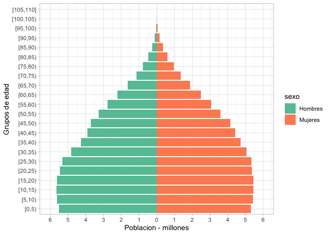<!-- -->

Esto es para el volumen de la población ¿Cómo podemos hacer una pirámide
que sea en términos de proporciones?

Vamos a necesitar el total de la población:

``` r
pob_mit_proyecciones<-pob_mit_proyecciones %>% 
  group_by(cve_geo, ano) %>% 
  mutate(p_edo=sum(poblacion)) %>% 
  ungroup()

head(pob_mit_proyecciones)
```

    ## # A tibble: 6 x 10
    ##   renglon   ano entidad    cve_geo  edad sexo  poblacion eda5  poblacion2  p_edo
    ##     <int> <int> <chr>        <int> <int> <chr>     <int> <fct>      <int>  <int>
    ## 1       1  1950 República…       0     0 Homb…    572103 [0,5)    -572103 2.70e7
    ## 2       2  1950 República…       0     0 Muje…    559162 [0,5)     559162 2.70e7
    ## 3       3  1950 República…       0     1 Homb…    514540 [0,5)    -514540 2.70e7
    ## 4       4  1950 República…       0     1 Muje…    505269 [0,5)     505269 2.70e7
    ## 5       5  1950 República…       0     2 Homb…    478546 [0,5)    -478546 2.70e7
    ## 6       6  1950 República…       0     2 Muje…    469322 [0,5)     469322 2.70e7

Hoy sí haremos lo mismo pero para las proporciones:

``` r
pob_mit_proyecciones<-pob_mit_proyecciones %>% 
  mutate(poblacion3=if_else(sexo=="Hombres", -poblacion/p_edo, poblacion/p_edo))
```

Una vez que ya tenemos nuestra variable proporcional:

``` r
pob_mit_proyecciones %>% 
  filter(cve_geo==0) %>% 
  filter(ano==2020) %>%  
  ggplot(aes(eda5, fill=sexo, weights=poblacion3))+
    geom_bar() + coord_flip() +
   scale_y_continuous(labels = scales::percent_format(accuracy=0.01))+ 
  labs(y="Poblacion - %", x="Grupos de edad") +
  scale_fill_brewer(palette = "Set2") + 
  theme_light() +   theme(axis.text.x  =  element_text(angle = 90))  
```

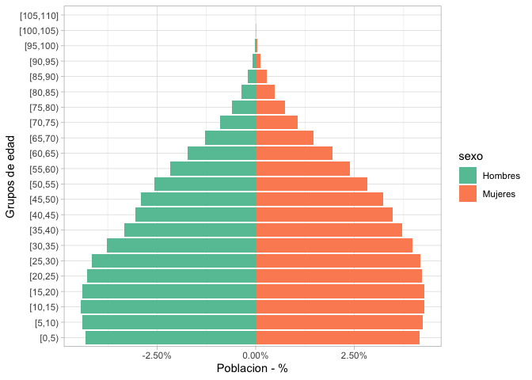<!-- -->

Podemos hacer varias pirámides aplicando facets o grids:

``` r
pob_mit_proyecciones %>% 
  filter(cve_geo==0) %>% 
  filter(ano%in%seq(2020,2050, by=10)) %>%  
  ggplot(aes(eda5, fill=sexo, weights=poblacion3))+
    geom_bar() + coord_flip() +
   scale_y_continuous(labels = scales::percent_format(accuracy=0.01))+ 
  labs(y="Poblacion - %", x="Grupos de edad") +
  scale_fill_brewer(palette = "Set2") + 
  theme_light() +   theme(axis.text.x  =  element_text(angle = 90))  +
  facet_wrap(~ano)
```

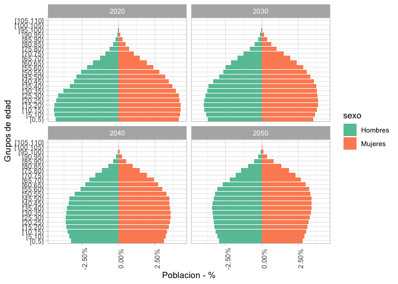<!-- -->

# Función propia

Así que podemos hacer una función de pirámide:

``` r
piramide<-function(ent, ano) {
 x<-ent
 a<-ano 
  pob_mit_proyecciones %>% 
    filter(cve_geo==x) %>% 
    filter(ano==a) %>%  
    ggplot(aes(eda5, fill=sexo, weights=poblacion3))+
    geom_bar() + coord_flip() +
    scale_y_continuous(labels = scales::percent_format(accuracy=0.01))+ 
    labs(y="Poblacion - %", x="Grupos de edad") +
    scale_fill_brewer(palette = "Set2") + 
    theme_light()    
}
```

Veamos si funciona:

``` r
piramide(1, 1990)
```

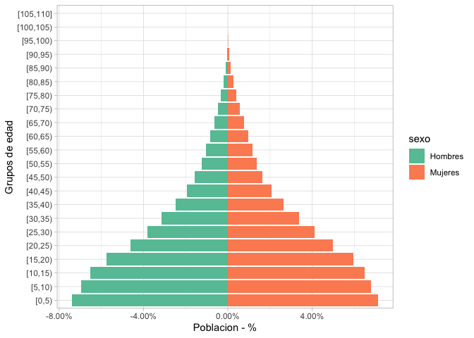<!-- -->

``` r
piramide(12, 2050)
```

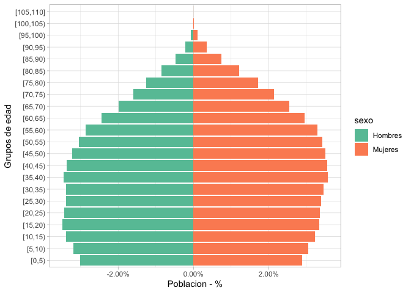<!-- -->

# Pirámides con bases de datos no agrupadas

Vamos a hacer un ejemplo de edad simple, y de cómo hacemos cuando los
datos no están agrupados. Lo más fácil para volver negativos a los
hombres es crear una nueva variable

``` r
ecovid0420 %>% 
  mutate(dummy=if_else(pb1==1,
                       -1,
                       1)) %>% 
  ggplot(aes(pb2, 
             fill=as_label(pb1), 
             weights=dummy))+
    geom_histogram(binwidth = 5) + coord_flip() 
```

    ## Warning: Removed 25 rows containing non-finite values (stat_bin).

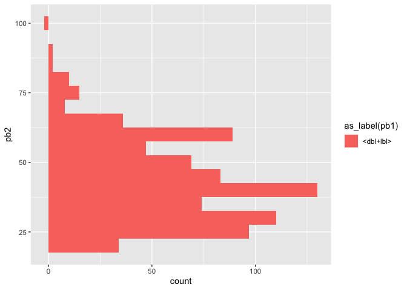<!-- -->

# Paquete “apyramid”

Necesita que tengamos los datos quinquenales No acepta funciones en las
variables edad y sexo

``` r
pira <- pob_mit_proyecciones %>% 
  filter(cve_geo==0) %>% 
  filter(ano==2020) %>%
  age_pyramid(eda5, # edad
              split_by = sexo,
              count=poblacion) # sexo

pira + theme_minimal()
```

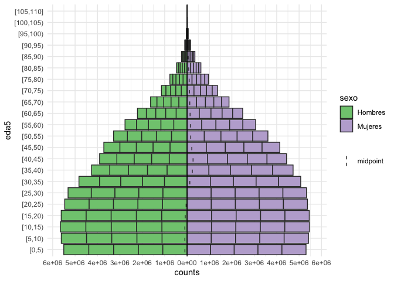<!-- --> Nos
ahorra un par de pasos, pero siempre tenemos que solucionar algunos
elemtnos

``` r
pira <- pob_mit_proyecciones %>% 
  filter(cve_geo==0) %>% 
  filter(ano==2020) %>%
  age_pyramid(eda5, # edad
              split_by = sexo,
              count=poblacion) # sexo

pira + theme_minimal()
```

<!-- -->
